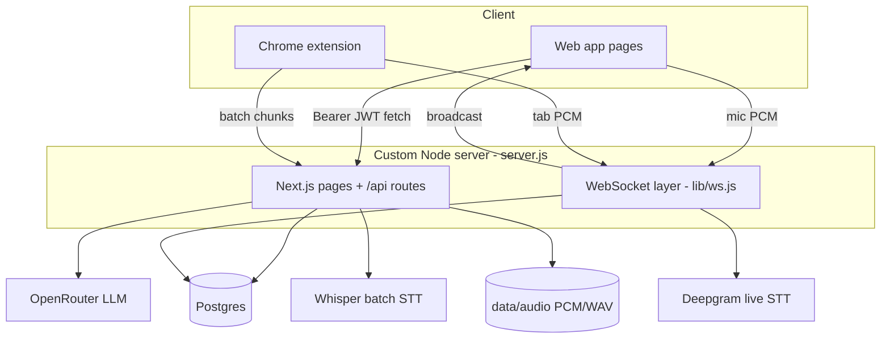
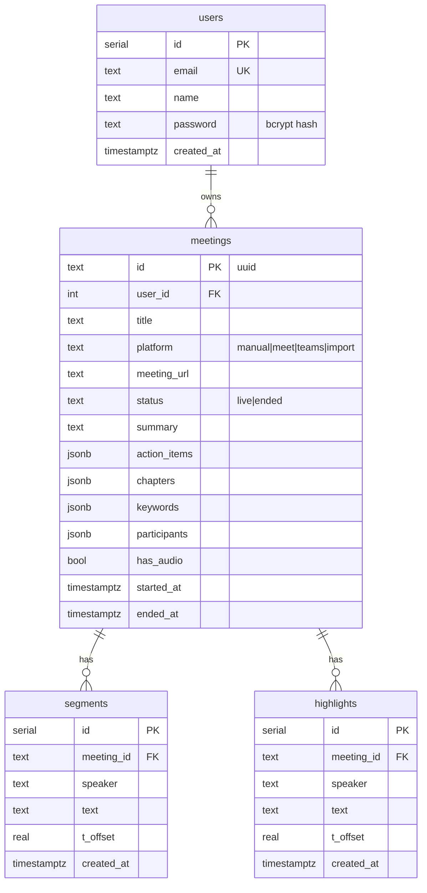
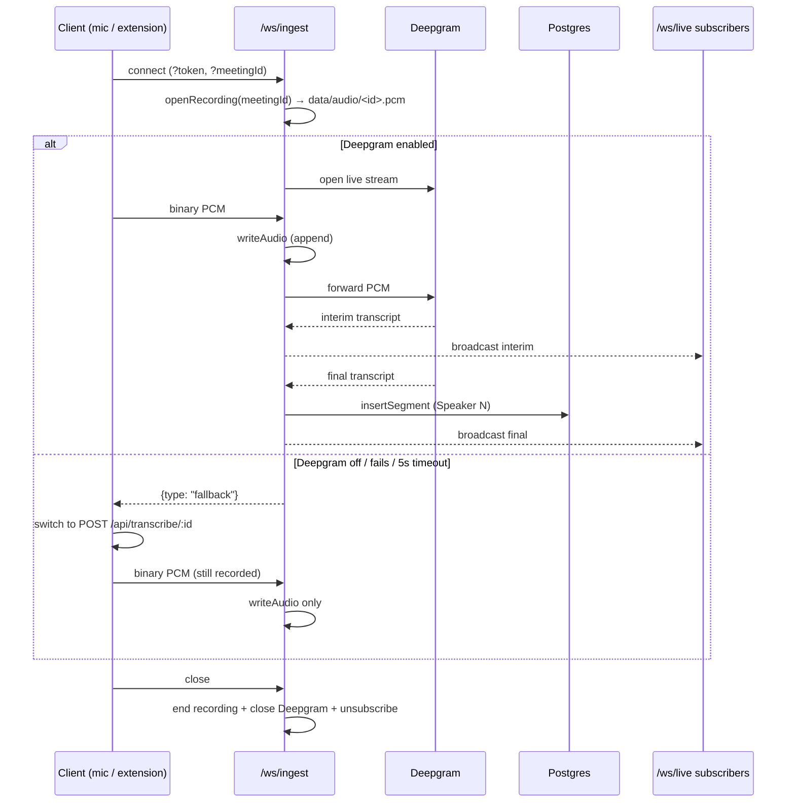

# NOTEAI — Knowledge Transfer (KT) Guide

A deep-dive onboarding document for engineers taking over NOTEAI. It explains the
architecture, data model, request/realtime flows, external integrations, the
browser extension, and the operational gotchas you need to know.

> For setup/running instructions, see `README.md`. This document focuses on **how
> the system works and why**.

---

## 1. What NOTEAI is

NOTEAI is a full-stack **Next.js 14 (App Router)** application for AI meeting notes:

- Record or stream meeting audio and get a **live transcript**.
- Generate **AI notes** (title, summary, action items, chapters, keywords).
- **Ask questions** about a meeting's transcript.
- Play back the recorded audio with seeking.
- Capture Google Meet / Microsoft Teams calls via a **Chrome extension**.

There are two clients: the **web app** (mic-based recording + management UI) and the
**Chrome extension** (captures meeting-tab audio). Both talk to the same backend.

---

## 2. Architecture overview

### Why a custom server?
`server.js` boots the app because the realtime layer needs raw WebSocket upgrades,
which Next.js route handlers cannot host. Boot order:

1. `require('dotenv').config()` — load env.
2. `await initDb()` — idempotent schema creation.
3. `await app.prepare()` — Next.js.
4. `createServer(...)` handing HTTP to Next + `attachWebSocket(server)`.
5. `server.listen(PORT)`.

`next.config.js` marks `pg`, `bcryptjs`, `jsonwebtoken`, `ws` as
`serverComponentsExternalPackages` so these Node-only deps run natively (shared by
both the custom server and API routes) rather than being webpack-bundled.

**Key files:** `server.js`, `next.config.js`, `package.json`, `mise.toml` (Node 20).

---

## 3. Data model (Postgres)

Connection: a single `pg.Pool` (`max: 10`) built from `DATABASE_URL` in `lib/db.js`,
exposing `pool` and `query(text, params)`.

Schema bootstrap: `lib/initDb.js` runs one idempotent SQL block
(`CREATE TABLE IF NOT EXISTS ...`) once per process (memoized). **There is no
migration tool** — altering existing columns needs manual SQL.

Indexes: `idx_meetings_user(user_id)`, `idx_segments_meeting(meeting_id)`,
`idx_highlights_meeting(meeting_id)`.

**Gotcha:** FKs have **no `ON DELETE CASCADE`**. The DELETE meeting route removes
`highlights` → `segments` → `meeting` in order (plus the audio files). Bypassing that
path can orphan rows.

---

## 4. Authentication

**Helpers — `lib/auth.js`:**
- `signToken(user)` → JWT `{ uid, email }`, `expiresIn: '30d'`, signed with
  `JWT_SECRET` (fallback `'dev-insecure-secret'` — must be overridden in prod).
- `verifyToken(token)` → payload or `null`.
- `getUserFromRequest(request)` → reads `Authorization: Bearer <token>` **or**
  `?token=` query param. The query-param path exists because `<audio>` elements and
  WebSockets can't send custom headers.

**Routes (all `force-dynamic`):**
- `POST /api/auth/signup` — validate email + password (≥6 chars), reject dup (409),
  `bcrypt.hashSync(pw, 10)`, insert, return `{ token, user }`.
- `POST /api/auth/login` — lookup by lowercased email, `bcrypt.compareSync`,
  return `{ token, user }` or 401.
- `GET /api/auth/me` — auth-guarded, returns `{ user }`.

**Client storage:** the web app stores the JWT in `localStorage`
(`noteai_token` / `noteai_user`) via the `auth` store in `lib/client/api.js`. Every
request adds `Authorization: Bearer <token>`.

---

## 5. Meetings domain

**`lib/meetings.js`:**
- `serialize(m)` — snake_case row → camelCase API shape; `fmtTs` normalises
  TIMESTAMPTZ to `YYYY-MM-DD HH:MM:SS` (UTC, no `Z`) so the client appends `Z`.
- `getMeeting(id, userId)` — full meeting + `segments` (by id) + `highlights` (by t_offset).
- `ownsMeeting(id, userId)` — ownership guard used by most routes.

**Endpoints** (all require auth; most check ownership):

| Endpoint | Method | Purpose |
|---|---|---|
| `/api/meetings` | GET | List meetings; `?q=` searches title/summary/segments (`ILIKE`) |
| `/api/meetings` | POST | Create a live meeting (UUID id) |
| `/api/meetings/[id]` | GET | Full meeting + transcript |
| `/api/meetings/[id]` | DELETE | Delete highlights→segments→meeting + audio |
| `/api/meetings/[id]/ask` | POST | Q&A over transcript (`maxDuration=120`) |
| `/api/meetings/[id]/audio` | GET | Stream WAV/import with Range/seek; auth via header or `?token=` |
| `/api/meetings/[id]/end` | POST | Mark ended + generate AI notes (`maxDuration=300`) |
| `/api/meetings/[id]/highlights` | POST | Bookmark a transcript moment |
| `/api/meetings/[id]/highlights/[hid]` | DELETE | Remove a highlight |
| `/api/meetings/[id]/participants` | POST | Store attendee roster (dedup, trim, max 50) |
| `/api/meetings/[id]/segments` | POST | Append one/many transcript segments |
| `/api/meetings/[id]/speakers` | POST | Rename one speaker across segments+highlights |
| `/api/meetings/[id]/speakers/bulk` | POST | Bulk rename `{ map: {from: to} }` |
| `/api/meetings/import` | POST | Upload media → transcribe → summarize (`maxDuration=300`) |

---

## 6. Realtime transcription

### WebSocket layer — `lib/ws.js`
Two endpoints, both authed via `?token=` + `?meetingId=` (validated against
`meetings.user_id`):

- **`/ws/ingest`** — a client streams raw PCM up.
- **`/ws/live`** — dashboards subscribe to interim + final transcripts.

A per-meeting **hub** (`Map<meetingId, Set<WebSocket>>`) fans out via `broadcast()`.
`attachWebSocket()` intercepts only these two upgrade paths (letting Next HMR through)
and returns 401 on failed auth.

### Ingest flow (`handleIngest`)

- Audio is **always persisted**, even when transcription is unavailable. The first
  write sets `meetings.has_audio = true`.
- A 5s `readyTimer` triggers fallback if Deepgram doesn't open in time.

### Deepgram service — `lib/services/deepgram.js`
- `deepgramEnabled()` → `DEEPGRAM_API_KEY` present.
- `transcribeFile(buffer, mimetype)` — POST `api.deepgram.com/v1/listen`
  (`smart_format, punctuate, diarize, utterances`) → `[{speaker, text, start}]`.
- `openDeepgram({...})` — `wss://api.deepgram.com/v1/listen`
  (`encoding=linear16, sample_rate=16000, channels=1, interim_results, diarize,
  endpointing=300`); queues buffers until open, sends `KeepAlive` every 8s, exposes
  `send/finish/close`.

### Batch STT service — `lib/services/transcription.js`
- `transcribeChunk(buffer, mimeType)` — multipart POST to a Whisper-compatible
  endpoint (`STT_API_URL`, `STT_MODEL`, optional `STT_LANGUAGE`); 3 retries with
  backoff on 429/5xx; `cleanText()` strips common Whisper hallucinations
  ("thanks for watching", "please subscribe", etc.).
- Batch route: `POST /api/transcribe/[meetingId]` — one chunk (`audio`, `speaker`,
  `tOffset`) → transcribe → insert segment → `{ text }` (`maxDuration=120`).

### Audio storage — `lib/audio.js`
- Files live under `data/audio/`.
- Live ingest appends raw PCM to `<id>.pcm`.
- `ensureWav()` lazily wraps PCM in a 44-byte WAV header (16 kHz mono 16-bit) as
  `<id>.wav`, regenerating only when the PCM grows.
- Imports are stored verbatim as `<id>.import.<ext>`.
- `deleteRecording()` removes pcm/wav/import.

### Client mic recorder — `lib/client/recorder.js`
`startMicIngest()` grabs the mic, downsamples to 16 kHz linear16 (via
`ScriptProcessorNode`), streams over `/ws/ingest`, and on `{type:'fallback'}` calls
`onFallback` to switch to the batch endpoint.

---

## 7. LLM features — `lib/services/llm.js`

OpenAI-compatible chat completions through **OpenRouter**.

- Config: `OPENROUTER_URL`, `OPENROUTER_API_KEY`, `OPENROUTER_MODEL`.
- `ALLOWED_MODELS` allowlist (7 free models); `modelChain(requested)` tries the
  requested/default model first, then falls through the rest on 429/502/503.
- `summarizeMeeting(segments, model)` — prompts for strict JSON
  `{title, summary, actionItems:[{text,owner}], chapters:[{title,summary}], keywords:[]}`;
  `safeParse()` extracts JSON defensively (falls back to raw text as summary).
- `askMeeting(segments, question, model)` — answers **only** from the transcript.
- Sends `HTTP-Referer` and `X-Title: NOTEAI` headers.

**Callers:** `summarizeMeeting` ← `/api/meetings/[id]/end` and `/api/meetings/import`;
`askMeeting` ← `/api/meetings/[id]/ask`.

---

## 8. Frontend

- Root: `app/layout.jsx` (Inter font + `Providers`), `app/page.jsx` (token-based
  redirect to `/app` or `/login`).
- Auth: `app/login/page.jsx` — combined login/signup; `auth.set()` then redirect.
- App shell: `app/app/layout.jsx` — auth guard + `Sidebar` + `RecordModal`.

| Screen | File | What it does |
|---|---|---|
| Home | `app/app/page.jsx` | Meeting list grouped by day, debounced search, import, record |
| Meeting detail | `app/app/m/[id]/page.jsx` | Summary/Transcript tabs, live captions, mic recording (`?record=1`), end & summarize, audio playback + seek, highlights, speaker rename, embedded Q&A chat |
| Chat | `app/app/chat/page.jsx` | Placeholder → per-meeting "Ask" |
| Explore / Integrations | `.../explore`, `.../integrations` | "Coming soon" placeholders |
| Settings | `app/app/settings/page.jsx` | Profile, AI model picker, theme, sign out |

**Client API — `lib/client/api.js`:** `auth` store (localStorage + `broadcastAuth`
via `postMessage` for the extension), `api()` Bearer fetch wrapper, `uploadAudio()`,
the `MODELS` list (mirrors the backend allowlist), model/theme helpers, and
formatting utils. `wsBase()` derives `ws(s)://` from the current origin.

**Components (`components/`):** `Sidebar`, `RecordModal` (creates a live meeting then
opens `/app/m/{id}?record=1`), `Avatar`, `Icons`, `Logo`, `Toast`, `Providers`.

---

## 9. Chrome extension (`extension/`)

MV3 extension that captures meeting-tab audio and streams it to the backend.

- **Manifest:** permissions `tabCapture, offscreen, storage, activeTab, scripting`;
  host permissions for Meet, Teams, and `http://localhost:3000/*`. Content scripts:
  Meet/Teams scrapers + live panel, plus **`content/sync-auth.js` on localhost:3000**.
- **`config.js`:** `API_BASE = http://localhost:3000`, `WS_BASE` derived,
  `CHUNK_MS = 6000` (hardcoded — change for prod).
- **`background.js`:** message router — `START_CAPTURE` (create meeting, get
  `tabCapture` stream id, spin up offscreen doc), `STOP_CAPTURE` (stop + `/end`),
  `SEGMENT`/`LEVEL`/`PARTICIPANTS`/`ADD_HIGHLIGHT`/`GET_STATE`. Caches `/api/config`
  streaming support.
- **`offscreen.js`:** captures tab audio (`chromeMediaSource: 'tab'`), also pipes it
  to speakers so the user still hears the call. **Stream path** taps PCM via an
  `AudioWorkletNode` (`pcm-worklet.js`, `ScriptProcessorNode` fallback), downsamples
  to 16 kHz Int16, sends to `/ws/ingest`. On `{type:'fallback'}` → **batch path**:
  ~6s WebM chunks via `MediaRecorder` POSTed to `/api/transcribe/:id`.
- **Content scripts:** `meet.js`/`teams.js` set platform, scrape participants, and
  provide a bot **auto-join** flow (`?meetnotes_autojoin=1`). `panel.js` renders a
  floating live-transcript panel with per-speaker colors and star-to-highlight.
- **`content/sync-auth.js`:** mirrors the web session into the extension. Reads
  `localStorage` `noteai_token`/`noteai_user` into `chrome.storage.local` as
  `token`/`user` via (1) initial read, (2) the app's `postMessage({source:'noteai',
  type:'AUTH'})` broadcast, and (3) cross-tab `storage` events. **Result:** logging
  into the web app also logs into the extension — no separate popup login.
- **Popup:** React/Vite source in `popup-src/`, built to `popup/` — login/signup,
  model picker, start/stop notes, level meter, dashboard link.

---

## 10. Configuration reference

| Var | Controls | Read in |
|---|---|---|
| `PORT` | server port (default 3000) | `server.js` |
| `JWT_SECRET` | JWT signing secret | `lib/auth.js` |
| `DATABASE_URL` | Postgres connection | `lib/db.js` |
| `DEEPGRAM_API_KEY` | enables live+file STT; empty → batch | `lib/services/deepgram.js` |
| `DEEPGRAM_MODEL` | Deepgram model (default `nova-3`) | deepgram.js |
| `DEEPGRAM_LANGUAGE` | Deepgram language (default `en`) | deepgram.js |
| `OPENROUTER_URL` | LLM endpoint | `lib/services/llm.js` |
| `OPENROUTER_API_KEY` | LLM auth | llm.js |
| `OPENROUTER_MODEL` | default LLM model | llm.js |
| `STT_API_URL` | batch Whisper endpoint | `lib/services/transcription.js` |
| `STT_API_KEY` | batch STT auth | transcription.js |
| `STT_MODEL` | batch STT model (default `whisper-1`) | transcription.js |
| `STT_LANGUAGE` | optional forced language | transcription.js |
| `NODE_ENV` | dev vs production | server.js |

Introspection: `GET /api/health` → `{ ok: true }`; `GET /api/config` →
`{ streaming: deepgramEnabled() }`.

> Note: `.env.example` defines `STT_API_URL`/`STT_MODEL` **twice** (OpenAI Whisper,
> then a Groq override) — the later value wins in a real `.env`.

---

## 11. Operational gotchas / known issues

- **No DB migrations.** Schema is a single idempotent create; altering existing
  columns requires manual SQL. Plan a migration tool if the schema will evolve.
- **FKs lack `ON DELETE CASCADE`.** Deletion order is enforced in app code; orphan
  rows are possible if you delete outside the DELETE route.
- **Insecure default JWT secret.** `'dev-insecure-secret'` is used if `JWT_SECRET`
  is unset — always set a strong secret in production.
- **`?token=` in URLs.** Needed for `<audio>` and WebSocket auth, but tokens can leak
  via logs/referrers. Consider short-lived signed URLs for production.
- **Extension URLs are hardcoded** to `localhost:3000` in `extension/config.js` and
  `extension/popup-src/Popup.jsx`; also update manifest `host_permissions` /
  `content_scripts` matches for any non-local deployment.
- **Speaker labels:** live diarization yields `Speaker N` (Deepgram); batch/fallback
  segments default to a generic `Speaker`. Users can rename via the speakers routes.
- **Audio is local disk** (`data/audio/`). For multi-instance / durable deployments,
  move this to object storage (e.g. S3) — the append-during-meeting model means
  recording locally then uploading on `/end` is the simplest migration.

---

## 12. First tasks checklist for a new engineer

1. Install Node 20, Postgres; `npm install`; `cp .env.example .env` and set
   `JWT_SECRET` + `DATABASE_URL`.
2. `npm run dev`, open `http://localhost:3000`, sign up, and create a meeting.
3. Add Deepgram + OpenRouter keys to see live transcription + AI notes end-to-end.
4. Load the extension (`chrome://extensions` → Load unpacked → `extension/`), confirm
   auto-login from the web app, and test capture on a Meet/Teams call.
5. Read, in order: `server.js` → `lib/ws.js` → `lib/services/*` → `app/api/meetings/**`
   → `app/app/m/[id]/page.jsx`.
