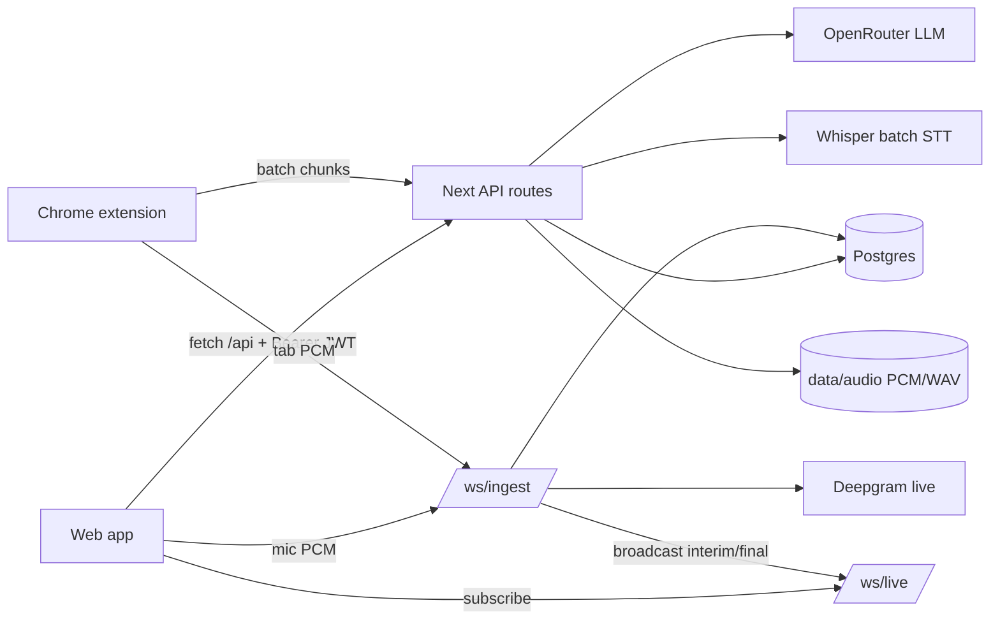

# NOTEAI — AI Meeting Notes

Full-stack **Next.js 14** app for live meeting transcription, AI summaries, and searchable notes — with a companion **Chrome extension** that captures Google Meet / Microsoft Teams tab audio.

- 🎙️ **Live transcription** over WebSockets (Deepgram) with a Whisper batch fallback
- 🧠 **AI notes** — title, summary, action items, chapters, keywords, and transcript Q&A (OpenRouter)
- 🔊 **Audio playback** with seek (HTTP Range) from recorded PCM/WAV
- 🧩 **Chrome extension** for Meet/Teams that shares login with the web app
- 🗄️ **Postgres** storage with auto-initialised schema

---

## Tech stack

| Layer | Tech |
|---|---|
| Framework | Next.js 14 (App Router) + custom Node server |
| Realtime | `ws` WebSocket server (`/ws/ingest`, `/ws/live`) |
| Database | Postgres via `pg` |
| Auth | JWT (`jsonwebtoken`) + `bcryptjs` |
| Live STT | Deepgram (streaming + file) |
| Batch STT | Whisper-compatible endpoint (OpenAI/Groq) |
| LLM | OpenRouter (OpenAI-compatible chat completions) |
| UI | React 18, Tailwind CSS |
| Extension | Chrome MV3 (tabCapture + offscreen), React/Vite popup |
| Runtime | Node 20 (see `mise.toml`) |

---

## Prerequisites

- **Node 20** (`mise install` if you use [mise](https://mise.jdx.dev/), or install manually)
- **Postgres** running locally (or a connection string to a remote instance)
- API keys (optional but recommended): **Deepgram**, **OpenRouter**, and a **Whisper** STT endpoint

---

## Quick start

```bash
# 1. Install dependencies
npm install

# 2. Configure environment
cp .env.example .env
#    then edit .env — at minimum set JWT_SECRET and DATABASE_URL

# 3. Create the database (schema auto-creates on first boot)
createdb noteai        # or use your own DATABASE_URL target

# 4. Run in development
npm run dev            # → http://localhost:3000
```

The database **schema is created automatically** on server boot (see `lib/initDb.js`) — there is no separate migration step. You only need the database to exist.

### Production

```bash
npm run build
npm start               # NODE_ENV=production node server.js
```

---

## npm scripts

| Script | Command | Purpose |
|---|---|---|
| `npm run dev` | `node server.js` | Dev server (Next + WebSockets + DB init) |
| `npm run build` | `next build` | Production build |
| `npm start` | `cross-env NODE_ENV=production node server.js` | Production server |
| `npm run lint` | `next lint` | Lint |

> ⚠️ The app uses a **custom server** (`server.js`), not `next dev`/`next start`, because the raw WebSocket layer (`/ws/ingest`, `/ws/live`) cannot be hosted by Next.js route handlers.

---

## Environment variables

Copy `.env.example` → `.env` and fill in:

| Variable | Required | Default | Controls |
|---|---|---|---|
| `PORT` | no | `3000` | HTTP/WebSocket server port |
| `JWT_SECRET` | **yes** | `dev-insecure-secret` | JWT signing secret — **set this in production** |
| `DATABASE_URL` | **yes** | — | Postgres connection string |
| `DEEPGRAM_API_KEY` | no | — | Enables **live** + file STT; empty → batch fallback |
| `DEEPGRAM_MODEL` | no | `nova-3` | Deepgram model |
| `DEEPGRAM_LANGUAGE` | no | `en` | Deepgram language |
| `OPENROUTER_URL` | no | — | LLM endpoint (OpenAI-compatible) |
| `OPENROUTER_API_KEY` | no | — | LLM auth (summaries, Q&A) |
| `OPENROUTER_MODEL` | no | see `.env.example` | Default LLM model |
| `STT_API_URL` | no | — | Batch Whisper endpoint (used when Deepgram off) |
| `STT_API_KEY` | no | — | Batch STT auth |
| `STT_MODEL` | no | `whisper-1` | Batch STT model |
| `STT_LANGUAGE` | no | — | Optional forced STT language |
| `APP_URL` | no | `http://localhost:3000` | Public base URL (bot target + OAuth redirect base) |
| `BOT_NAME` | no | `NoteAI Notetaker` | Display name the bot joins meetings with |
| `BOT_HEADFUL` | no | `0` | `1` = headful Chromium (use with `xvfb-run` if headless audio is silent) |
| `BOT_MAX_MINUTES` | no | `120` | Hard cap per bot meeting |
| `BOT_ADMISSION_TIMEOUT_MIN` | no | `10` | Lobby wait before giving up |
| `BOT_MAX_CONCURRENT` | no | `3` | Max simultaneous bot Chromiums |
| `GOOGLE_CLIENT_ID` / `GOOGLE_CLIENT_SECRET` | no | — | Enables Google Calendar auto-join |
| `S3_BUCKET` | no | — | Enables S3 audio storage; empty → local `data/audio/` |
| `S3_ENDPOINT` / `S3_REGION` / `S3_ACCESS_KEY_ID` / `S3_SECRET_ACCESS_KEY` | no | — | S3 credentials (`S3_ENDPOINT` e.g. MinIO) |
| `S3_FORCE_PATH_STYLE` | no | `1` | Path-style URLs (required for MinIO) |
| `S3_PROXY` | no | `0` | `1` = proxy audio through the server instead of presigned redirect |

> Without `DEEPGRAM_API_KEY`, the app falls back to the **batch Whisper** path (`STT_*`). Without `OPENROUTER_API_KEY`, AI summaries/Q&A are unavailable but transcription still works.

Introspection endpoints:
- `GET /api/health` → `{ ok: true }`
- `GET /api/config` → `{ streaming: <deepgram enabled?> }`

---

## How it works



1. A meeting is created (`POST /api/meetings`, status `live`).
2. Audio streams to `/ws/ingest` as 16 kHz linear16 PCM (from the browser mic or the extension's tab capture).
3. If Deepgram is configured, interim/final transcripts are broadcast to dashboards on `/ws/live` and finals are persisted as `segments`. Raw PCM is always saved to `data/audio/<id>.pcm`.
4. If Deepgram is unavailable, the server tells the client to fall back to batch mode (`POST /api/transcribe/:id`).
5. On end (`POST /api/meetings/:id/end`), the transcript is sent to the LLM to generate the title, summary, action items, chapters, and keywords.
6. Recorded audio is played back via `GET /api/meetings/:id/audio` (WAV wrapped lazily from PCM, with Range/seek support). With S3 configured, finished recordings are uploaded and playback redirects to a presigned URL.

---

## Notetaker bot (Meet & Teams)

The bot is a Playwright Chromium that joins a meeting as a guest, taps the
WebRTC audio in-page, and streams it into the same `/ws/ingest` pipeline the
extension uses — so live captions, summaries, and playback all work unchanged.

One-time setup:

```bash
npx playwright install --with-deps chromium
```

- **Send it manually**: paste a Meet/Teams link into the bar at the top of the home page. The bot appears in the lobby as `BOT_NAME` — admit it from the host account.
- **Autopilot**: connect Google Calendar on `/app/integrations` (needs `GOOGLE_CLIENT_ID`/`GOOGLE_CLIENT_SECRET`, redirect URI `${APP_URL}/api/integrations/google/callback`). Events with Meet/Teams links get a scheduled bot job; per-event toggles + a global autopilot switch live on the same page.
- **Spike/debug**: `node bot/runner.js --spike <meet-url>` joins a call standalone and logs capture RMS every 5 s — use this to confirm headless audio capture works in your environment. If RMS stays near zero, set `BOT_HEADFUL=1` and run under `xvfb-run`.
- Bot state machine (`bot_jobs.status`): `scheduled → pending → joining → waiting_admission → recording → ended` (or `failed`/`skipped`). On failure a screenshot is saved to `data/bot/<jobId>.png`.
- The bot leaves on its own when the meeting ends, when it's alone for 5 min, when removed via the UI, or at `BOT_MAX_MINUTES`.

## S3 audio storage (optional)

Set the `S3_*` vars to store finished recordings in any S3-compatible bucket
(AWS S3, MinIO, …). Live PCM still appends to local disk during recording; the
WAV is uploaded when the meeting ends. Quick local MinIO:

```bash
docker run -p 9000:9000 -p 9001:9001 minio/minio server /data --console-address :9001
# then: S3_ENDPOINT=http://localhost:9000 S3_BUCKET=noteai S3_ACCESS_KEY_ID=minioadmin S3_SECRET_ACCESS_KEY=minioadmin
```

---

## Project structure

```
server.js                 Custom Node server (Next + WebSockets + DB init)
next.config.js            Next config (externalises pg/bcrypt/jwt/ws)
mise.toml                 Node 20 toolchain pin
app/
  page.jsx                Root redirect (→ /app or /login)
  login/                  Combined login/signup screen
  app/                    Authenticated app shell + screens
    page.jsx              Meeting list (search, import, record)
    m/[id]/               Meeting detail (transcript, notes, audio, chat)
    chat/ explore/ integrations/ settings/
  api/
    auth/                 login, signup, me
    meetings/             CRUD + ask, audio, end, highlights, participants,
                          segments, speakers, import
    transcribe/[meetingId]/  Batch STT chunk endpoint
    config/ health/       Introspection
lib/
  db.js initDb.js         Postgres pool + schema bootstrap
  auth.js                 JWT sign/verify + request auth
  meetings.js             Meeting serialization/queries
  ws.js                   WebSocket ingest + live broadcast hub
  audio.js                PCM/WAV recording storage
  services/
    deepgram.js           Live + file STT
    transcription.js      Batch Whisper STT
    llm.js                OpenRouter summaries + Q&A
  client/
    api.js recorder.js    Browser API client + mic ingest
components/               Sidebar, RecordModal, Toast, Icons, etc.
extension/                Chrome MV3 extension (Meet/Teams capture)
data/audio/               Recorded audio (auto-created)
```

---

## Chrome extension

Captures tab audio from Google Meet / Microsoft Teams and streams it to the same backend.

**Load it:**
1. Open `chrome://extensions`, enable **Developer mode**.
2. **Load unpacked** → select the `extension/` folder.
3. Log in on the web app at `http://localhost:3000` — the extension **auto-logs-in** via a content script that mirrors the web session into extension storage (`extension/content/sync-auth.js`).

**Rebuild the popup** (React/Vite source in `extension/popup-src/`):
```bash
cd extension/popup-src
npm install
npm run build       # outputs to ../popup
```

> The extension's backend URL is hardcoded to `http://localhost:3000` in `extension/config.js` and `extension/popup-src/Popup.jsx`. Update both (and the manifest `host_permissions` / `content_scripts` matches) for non-local deployments.

---

## Notes & caveats

- **No DB migration framework** — schema is a single idempotent `CREATE TABLE IF NOT EXISTS`. Column changes require manual SQL.
- **Foreign keys have no `ON DELETE CASCADE`** — deletion order is handled in app code.
- **`?token=` in URLs** (audio playback + WebSocket auth) is used because `<audio>` and WS can't send headers; acceptable for local dev, harden for production.
- Always set a strong **`JWT_SECRET`** in production — the fallback is insecure.

See `KT.md` for a detailed knowledge-transfer / onboarding guide.
